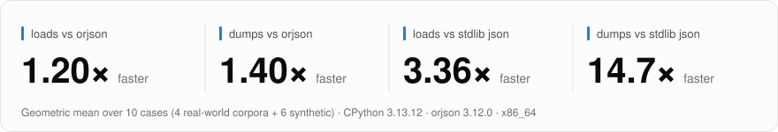
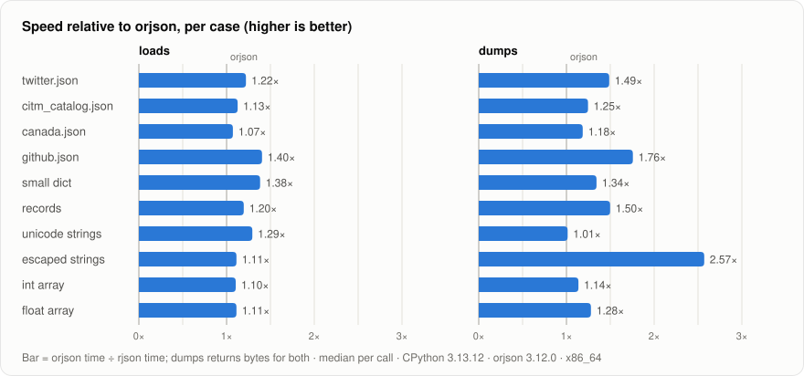

# rjson

[](https://github.com/TinDang97/rjson/actions/workflows/ci.yml)
[](LICENSE)
[](#compatibility)
[](#status)

**Fast JSON for Python, written in Rust directly against the CPython C API.**
It beats [orjson](https://github.com/ijl/orjson) on every case of our reference benchmark
and on most production workloads, and parses 3.4× / serializes 14.7× faster than the
standard library `json`. Output is byte-identical to orjson.

<picture>
  <source media="(prefers-color-scheme: dark)" srcset="docs/img/headline-dark.svg">
  
</picture>

<picture>
  <source media="(prefers-color-scheme: dark)" srcset="docs/img/vs-orjson-dark.svg">
  
</picture>

<details>
<summary>Numbers behind the charts, and how they were measured</summary>

Speedup = other library's time ÷ rjson's time (**higher is better**). Median time per call,
CPython 3.13.12, orjson 3.12.0, x86_64 (Xeon, idle host), plain release build (no PGO).
`dumps` returns `bytes` in both rjson and orjson. Raw results:
[docs/img/benchmark-results.json](docs/img/benchmark-results.json).

| case | loads vs orjson | dumps vs orjson | loads vs json | dumps vs json |
|---|---|---|---|---|
| twitter.json | 1.22× | 1.49× | 2.88× | 13.0× |
| citm_catalog.json | 1.13× | 1.25× | 2.50× | 9.15× |
| canada.json | 1.07× | 1.18× | 4.94× | 18.6× |
| github.json | 1.40× | 1.76× | 2.82× | 16.6× |
| small dict | 1.38× | 1.34× | 4.89× | 17.7× |
| records | 1.20× | 1.50× | 2.20× | 12.9× |
| unicode strings | 1.29× | 1.01× | 1.46× | 44.1× |
| escaped strings | 1.11× | 2.57× | 4.85× | 5.19× |
| int array | 1.10× | 1.14× | 3.06× | 12.8× |
| float array | 1.11× | 1.28× | 7.93× | 18.9× |
| **geomean** | **1.20×** | **1.40×** | **3.36×** | **14.7×** |

Reproduce and redraw:

```bash
benches/fetch_corpus.sh                                   # sha256-pinned corpora -> benches/data/
python benches/corpus_benchmark.py --json --repeat 11 --output-json results.json
python benches/make_charts.py results.json                # -> docs/img/*.svg + this table
```

`dumps_str` (returns `str`) is also faster than orjson on 8 of 10 cases; it trails on
twitter.json and unicode strings, because a `str` holding emoji must be stored at 4 bytes per
character. Methodology, per-version results (3.11 is faster still) and the roadmap:
[docs/PERFORMANCE_REVIEW.md](docs/PERFORMANCE_REVIEW.md).

</details>

## Installation

The PyPI distribution will be **`pyrjson`** (the name `rjson` on PyPI belongs to an
unrelated project). You still `import rjson`.

```bash
pip install pyrjson        # or: uv add pyrjson  (once published)
```

Until the first release, install from source (needs a Rust toolchain and CPython 3.10–3.14):

```bash
pip install "git+https://github.com/TinDang97/rjson"
# or, from a checkout:
pip install maturin && maturin develop --release
```

`.github/workflows/wheels.yml` builds PGO-optimized wheels for manylinux/musllinux (x86_64,
aarch64), macOS and Windows.

## Usage

```python
import rjson

data = rjson.loads('{"name": "rjson", "tags": ["fast", "safe"], "stars": 1e3}')
payload = rjson.dumps(data)        # b'{"name":"rjson","tags":["fast","safe"],"stars":1000.0}'
text = rjson.dumps_str(data)       # the same JSON as a str
```

| name | kind | notes |
|---|---|---|
| `loads(data)` | function → object | `data`: `str`, `bytes`, `bytearray` or `memoryview` (any layout) |
| `dumps(obj)` | function → `bytes` | compact UTF-8 JSON, like `orjson.dumps` |
| `dumps_str(obj)` | function → `str` | like `json.dumps(obj, ensure_ascii=False, separators=(",", ":"))` |
| `dumps_bytes(obj)` | function → `bytes` | alias of `dumps`, kept for compatibility |
| `JSONDecodeError` | exception | `json.JSONDecodeError` itself (a `ValueError`) |
| `JSONEncodeError` | exception | subclass of **both** `TypeError` and `ValueError`, like `orjson.JSONEncodeError` |
| `__version__` | `str` | package version |

The wheel ships type stubs (`py.typed`), so mypy and pyright check calls to rjson.

- **Types:** `dict` (str keys), `list`, `tuple`, `str`, `int` (any size), `float`, `bool`,
  `None`, and their subclasses (`IntEnum`, `str` enums, `OrderedDict`, `namedtuple`, …).
- **Errors:** `loads` raises `JSONDecodeError` with `pos`/`lineno`/`colno` matching `json`.
  `dumps`/`dumps_str` raise `JSONEncodeError` for unsupported types, non-str keys,
  NaN/Infinity, and nesting deeper than 254 (which also catches circular references), so
  both `except TypeError` and `except ValueError` catch it. A lone surrogate raises
  `UnicodeEncodeError` in `dumps`; `dumps_str` passes it through.
- **Precision:** floats round-trip exactly (shortest representation, e.g. `1e+16`), and
  integers of any size are exact in both directions. `loads` accepts nesting up to 1024.

## Migrating from `json` or orjson

Most code migrates with a find-and-replace:

| you wrote | with rjson |
|---|---|
| `json.loads(s)` / `orjson.loads(s)` | `rjson.loads(s)` |
| `orjson.dumps(obj)` | `rjson.dumps(obj)` (same bytes) |
| `json.dumps(obj, separators=(",", ":"), ensure_ascii=False)` | `rjson.dumps_str(obj)` |
| `json.dumps(obj).encode()` | `rjson.dumps(obj)` |
| `except json.JSONDecodeError` / `orjson.JSONDecodeError` | `except rjson.JSONDecodeError` |
| `except TypeError` / `orjson.JSONEncodeError` around `dumps` | `except rjson.JSONEncodeError` (`TypeError` keeps working) |

What does **not** carry over yet, and how to handle it:

| feature | status | workaround |
|---|---|---|
| `default=` hook | [#4](https://github.com/TinDang97/rjson/issues/4) | call `rjson.dumps`; on `JSONEncodeError`, convert in Python and retry (native data pays nothing) |
| datetime, UUID, dataclass, plain `Enum` | [#5](https://github.com/TinDang97/rjson/issues/5) | same fallback; see [`examples/codec.py`](examples/codec.py) |
| non-str dict keys | [#6](https://github.com/TinDang97/rjson/issues/6) | convert keys first (`json` coerces them, orjson needs `OPT_NON_STR_KEYS`) |
| NaN / Infinity | by design | `dumps` raises (`json` writes `NaN`, orjson `null`) |
| lenient `loads` (BOM, `NaN`, lone `"\ud800"`) | [#7](https://github.com/TinDang97/rjson/issues/7) | rejected, like orjson; `json` accepts them |
| `indent`, `sort_keys` | planned | use `json` for human-facing output |
| floats below 1e-4 | by design | `1e-7`, same as orjson; `json` writes `1e-07` (same value, different bytes) |

### FastAPI

```python
from fastapi import FastAPI
from fastapi.responses import JSONResponse
import rjson

class RJSONResponse(JSONResponse):
    def render(self, content) -> bytes:
        return rjson.dumps(content)

app = FastAPI()

@app.get("/items")
def items() -> RJSONResponse:
    return RJSONResponse([{"id": 1, "name": "widget"}])
```

Return `RJSONResponse(...)` directly for native data. Don't set it as
`default_response_class`: that bypasses Pydantic's fast `dump_json` for endpoints with a
response model, for no gain. [`examples/fastapi_app.py`](examples/fastapi_app.py) adds a
fallback for datetime/UUID/models and rjson-parsed request bodies.

### Logging, NDJSON, Redis and Kafka

- [`examples/json_logging.py`](examples/json_logging.py): a `logging.Formatter` writing one
  JSON object per line (2.4 µs per record vs 5.2 µs with `json`), plus NDJSON read/write.
- [`examples/codec.py`](examples/codec.py): a versioned bytes codec for Redis/Kafka with
  typed round trips, and `value_serializer`/`value_deserializer` callables.
- [`docs/ASYNC.md`](docs/ASYNC.md): aiohttp, httpx, asyncpg, `redis.asyncio` and aiokafka
  one-liners.

## Production use

The full report, with every number and how it was measured:
[docs/PRODUCTION_READINESS.md](docs/PRODUCTION_READINESS.md).
In short, rjson is ready for services whose payloads are JSON-native (dicts, lists,
strings, numbers), and not yet a drop-in for code that relies on orjson's options.

<details>
<summary>FAQ</summary>

**Is it faster than orjson in real services, not just benchmarks?**
On our production-shaped suite (`benches/production_benchmark.py`: REST pages, request
bodies, NDJSON logs, 100 MB files, cache blobs) rjson is faster on most shapes (geomean
`dumps` 0.76×, `loads` 0.87× of orjson's time) and uses 30–37% less peak memory on large
`loads`. The report lists the few shapes where it is not.

**Is it safe?**
It checks the exact type of every value, reserves the worst-case output size before
writing, and version-gates every CPython internal it uses, with self-tests at import. 565
tests, fuzzing against `json`, and 0 mismatches against orjson on all benchmark workloads.
It is still 0.x: pin the version.

**Does it work with asyncio / uvloop?**
Yes. Calls are synchronous and hold the GIL, so a large payload blocks the event loop, and
`asyncio.to_thread` does not help. [docs/ASYNC.md](docs/ASYNC.md) shows what to do instead.

**Is it thread-safe?**
Yes, on regular (GIL) CPython builds. Threads do not parallelize JSON work. Free-threaded
builds (3.13t/3.14t) and subinterpreters are not supported yet.

**Why does `dumps` return `bytes`?**
It is what you send over the network or write to a file, and it avoids a copy. Use
`dumps_str` when you need a `str`.

**Why is `dumps_str` sometimes slower than `dumps`?**
A `str` containing emoji must store every character in 4 bytes, and CJK text in 2, while
UTF-8 `bytes` stay compact.

**Why does my previously accepted request now fail with a 422?**
`loads` rejects a UTF-8 BOM, `NaN`/`Infinity` literals and escaped lone surrogates, like
orjson does (the stdlib accepts them). See [#7](https://github.com/TinDang97/rjson/issues/7).

</details>

## Compatibility

- **CPython 3.10–3.14** on Linux x86_64/aarch64, macOS arm64 and Windows (CI). x86_64
  builds target x86-64-v2 and select AVX2/AVX-512 kernels at runtime.
- **Not supported:** PyPy, GraalPy, free-threaded (no-GIL) builds, subinterpreters.

### Status

Experimental. The API may change before 1.0; pin the version you test against.

## How it is fast

- `loads` is a hand-written single-pass parser that builds Python objects directly. It
  caches dict keys, sizes lists exactly, parses numbers 8 digits at a time with correctly
  rounded floats, and uses SIMD for strings, escapes and whitespace.
- `dumps` writes straight into the final `bytes`/`str` object. It dispatches on exact
  types with no reference-count traffic, uses AVX-512/AVX2/SSE2 escape kernels, and
  zmij/itoap number formatting.
- A few speedups rely on non-public CPython internals. Each is limited to the versions it
  was checked against, and the layout reads run a self-test at import (listed in
  `CLAUDE.md`).

Details: [docs/PERFORMANCE_REVIEW.md](docs/PERFORMANCE_REVIEW.md).

## Contributing

Bug reports and pull requests are welcome. [CONTRIBUTING.md](CONTRIBUTING.md) covers the
development setup, the hard rules for code that touches the C API, and how to benchmark.

```bash
uv venv .venv -p 3.13 && . .venv/bin/activate
uv pip install maturin orjson pytest
maturin develop --release && python -m pytest tests -q
```

| path | contents |
|---|---|
| `src/parser.rs`, `src/lemire.rs` | `loads` |
| `src/ser.rs` | `dumps` / `dumps_str` |
| `src/entry.rs`, `src/compat.rs` | C-API entry points, version-portable helpers |
| `rjson.pyi` | type stubs |
| `tests/` | pytest suites |
| `examples/` | FastAPI, logging/NDJSON and Redis/Kafka integrations (tested) |
| `benches/` | `corpus_benchmark.py` (reference), `production_benchmark.py` (production workloads), `perf_gate.py`, `make_charts.py` |
| `docs/` | performance review, production readiness report, async guide |

<details>
<summary>Troubleshooting source builds</summary>

- **Linker errors** (`symbol(s) not found for architecture arm64`): Python and Rust must
  target the same architecture. Check with `python3 -c "import platform; print(platform.machine())"`;
  on Apple Silicon use an arm64 Python such as `/opt/homebrew/bin/python3`, then
  `cargo clean` and rebuild.
- **Missing Python headers:** install your Python's development package (e.g. `python3-dev`).

</details>

## Roadmap

- `default=` hook and native datetime/UUID/dataclass/Enum ([#4](https://github.com/TinDang97/rjson/issues/4), [#5](https://github.com/TinDang97/rjson/issues/5))
- Options: non-str keys ([#6](https://github.com/TinDang97/rjson/issues/6)), lenient `loads` ([#7](https://github.com/TinDang97/rjson/issues/7)), `indent`, `sort_keys`
- Streaming decoder/encoder for async I/O; free-threading and subinterpreter support ([docs/ASYNC.md](docs/ASYNC.md#roadmap))
- NEON kernels for aarch64
- First PyPI release as `pyrjson`

## License

[MIT](LICENSE) © 2025 Tin Dang. `src/lemire.rs` is adapted from
[fast-float](https://github.com/aldanor/fast-float-rust) (MIT OR Apache-2.0).
