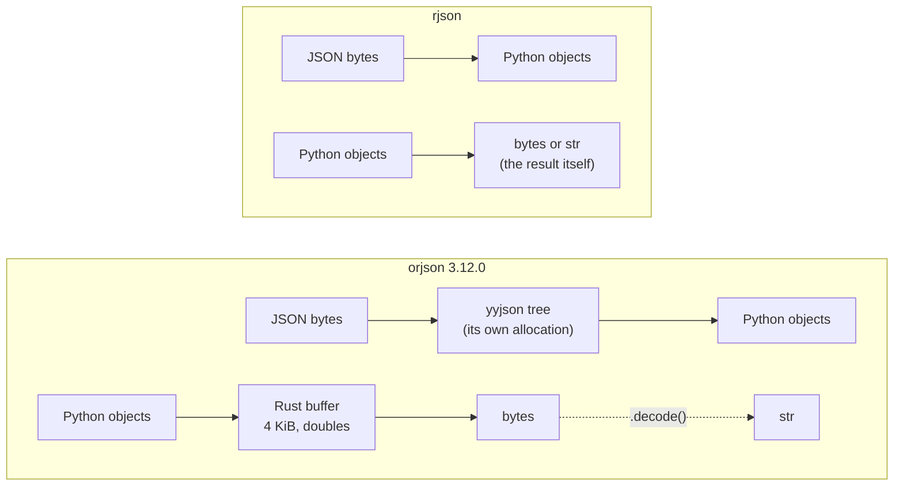
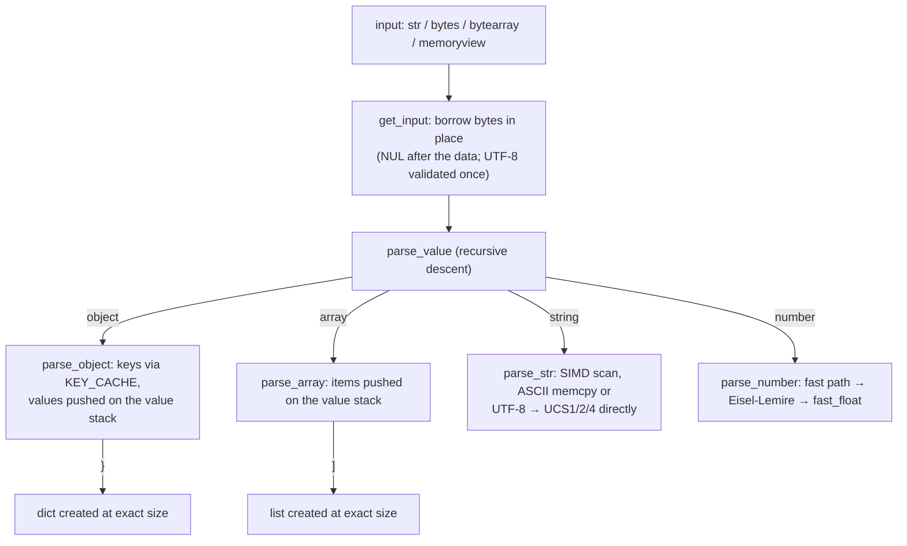
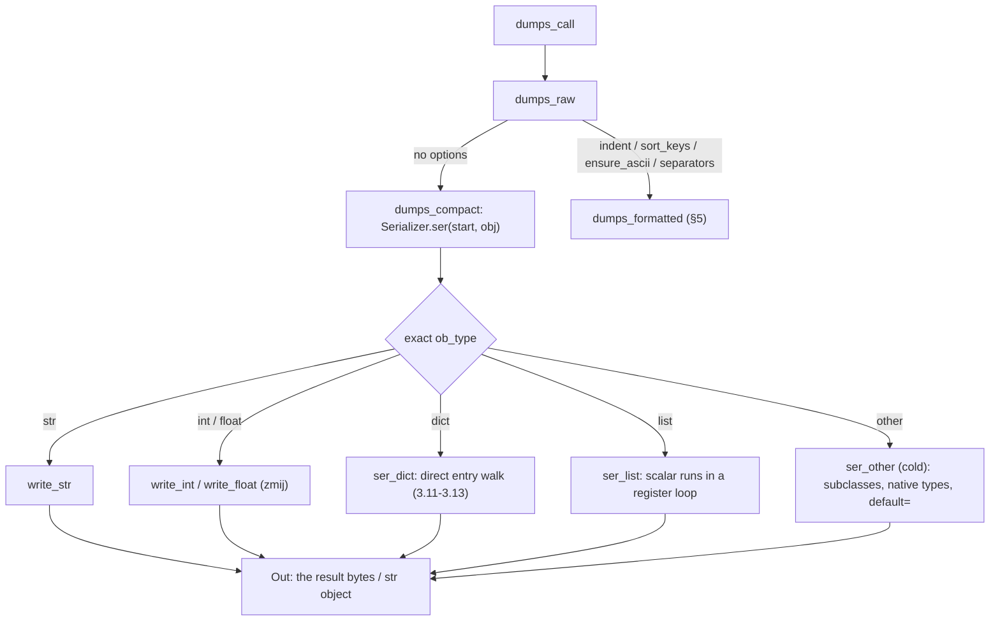

# rjson architecture

This document explains how rjson turns JSON text into Python objects and back, why each
piece is built the way it is, and what each choice was measured to be worth. It is written
for people who want to check the claims in the README, contribute, or borrow the ideas.

Numbers come from three sources, named at each use:

- **[W]** `benches/why_faster.py` ([results](why-faster-results.json)): head to head with
  orjson 3.12.0 on CPython 3.13, PGO wheel, x86_64 with AVX-512.
- **[R]** [PERFORMANCE_REVIEW.md](PERFORMANCE_REVIEW.md): per-change measurements taken when
  each change landed. They are rjson ÷ orjson time *at that point*, so below 1.00 is faster.
- **[S]** [SHOWCASE.md](SHOWCASE.md): production-shaped workloads.

Contents:

1. [The one idea](#1-the-one-idea)
2. [Anatomy of a call](#2-anatomy-of-a-call)
3. [`loads`: text to objects in one pass](#3-loads-text-to-objects-in-one-pass)
4. [`dumps`: objects to text, written into the result](#4-dumps-objects-to-text-written-into-the-result)
5. [Formatting options and the command line](#5-formatting-options-and-the-command-line)
6. [Safety architecture](#6-safety-architecture)
7. [Build and dispatch](#7-build-and-dispatch)
8. [Where orjson still wins, and why](#8-where-orjson-still-wins-and-why)
9. [Reading the code](#9-reading-the-code)

---

## 1. The one idea

A JSON library for Python spends its time in three places: reading or writing bytes,
creating or inspecting Python objects, and moving data between the two. The first is what
SIMD speeds up, and both rjson and orjson do it well. The second is fixed by CPython: every
`dict`, `str`, `int` and `float` has to be allocated and initialized either way. rjson's
design is about the third: **no intermediate representation in either direction.**

- `loads` never builds a tree, a token list or a Rust string. Each Python object is
  created the moment its closing token is read, from bytes that are still in cache.
- `dumps` never builds a Rust buffer to copy out. It writes into the `bytes` or `str`
  object that it returns, sized from what recent calls needed.

Everything else in this document is either a consequence of that rule, or a way to keep
per-value work small once the big copies are gone.

What the missing steps are worth, measured **[W]**:

| step removed | effect |
|---|---|
| `loads`: the tree | 85 MB vs 183 MB peak memory above a 60 MB input; 0.68 s vs 1.07 s |
| `dumps` to `str`: bytes + decode | 1.9 MB vs 3.2 MB allocated for twitter.json; 297 vs 478 µs |

---

## 2. Anatomy of a call

`src/entry.rs`

A call like `rjson.dumps(obj)` goes: CPython vectorcall → `METH_FASTCALL | METH_KEYWORDS`
C function → PyO3's panic-catching trampoline → `dumps_call` → `ser::dumps_raw`.

- **No `#[pyfunction]`.** The entry points are raw `PyMethodDef`s. They still go through
  PyO3's `impl_::trampoline`, so a Rust panic becomes a Python exception and PyO3's GIL
  bookkeeping stays right. That saves about 8 ns per call against the generated wrapper
  **[R]**.
- **One compare for the common call.** `dumps_call` checks "one positional argument, no
  keywords" and goes straight to the serializer with a constant `DumpsOpts::NONE`.
  Everything else (`default=`, `indent=`, …) is parsed in the cold `dumps_with_kwargs`.
  Building an options value on the hot path cost ~5 ns per call, because it owns a
  heap-allocated `Layout`; the constant avoids it.
- **One call site for `loads_impl`.** With two, LLVM stopped inlining `get_input` and
  `parse` and each call ran ~60 more instructions. This is recorded in `CLAUDE.md` so it
  isn't undone by accident.

Result: `loads('1')` ~25 ns and `dumps(None)` ~35 ns, against orjson's 67 and 53 ns
**[R]**. Instruction counts per call, which don't depend on host noise **[W]**:

| instructions per call | rjson | orjson |
|---|---|---|
| `dumps` small dict | 2,065 | 2,473 |
| `loads` small dict | 4,555 | 5,025 |

---

## 3. `loads`: text to objects in one pass

`src/parser.rs`, `src/lemire.rs`, entry in `src/entry.rs`

### 3.1 Input without copies

`get_input` borrows the input's bytes. `bytes` and `bytearray` are used as they are; a
`str` uses its compact ASCII data or its cached UTF-8. Every one of these CPython buffers
is followed by a NUL byte, so `peek()` never needs a bounds check: the NUL can't match any
token, and the parser stops there. A `memoryview` is parsed in place when it is
C-contiguous, at least 4 KiB and ends exactly where its underlying `bytes` ends, so the NUL
is there too. Otherwise it is copied once with a NUL appended.

UTF-8 of `bytes` input is validated once up front with `simdutf8`. The string code can then
decode without re-checking.

### 3.2 One value stack, containers at their exact size

The parser is recursive descent over `&[u8]`, with a single `Vec<*mut PyObject>` value
stack that is pooled across calls. An array pushes its items; at `]` the list is created
with exactly that many slots (a `PyMem_Malloc` item array attached to an empty list, which
skips `calloc`'s zeroing). An object pushes key/value pairs; at `}` the dict is built
presized, with `_PyDict_FromItems` on 3.13 (a private but exported symbol, version-gated).

So there is no per-array `Vec`, no per-key `String`, and no list that grows by
reallocation. On an error, every reference still on the stack is released, so nothing
leaks. Reusing the stack across calls saves ~100 ns on small documents **[R]**.

### 3.3 The key cache

Most JSON is records, so the same keys come back thousands of times. `KEY_CACHE` is a
direct-mapped table of 2,048 entries holding keys of up to 64 bytes:

- The hash is one folded 64×64→128-bit multiply of the key's first and last 8 bytes and
  its length (`hash_key`).
- A hit is confirmed by comparing the raw bytes, 16 at a time (`key_bytes_eq`), so a hash
  collision can never return the wrong key.
- A hit returns the same `PyUnicode` object with its hash already computed. The dict insert
  then skips hashing, and the result holds one copy of each key instead of one per record.

Measured at 25–30% of `loads` time on record-shaped documents **[R]**. It is also why a
300k-record result takes 193 MB instead of 420 MB **[R]**.

### 3.4 Strings

`scan_special` finds the next `"`, `\` or control byte 16 bytes at a time with SSE2, and in
the same pass notes whether any byte was non-ASCII. Then:

- **ASCII, no escapes** (most strings): `PyUnicode_New(len, 127)` plus one `memcpy`.
- **Non-ASCII**: decoded from UTF-8 straight into the final UCS1, UCS2 or UCS4 buffer: one
  counting pass, one writing pass, no temporary. For UCS2 text (CJK, Cyrillic),
  `decode_ucs2` widens 8/16 ASCII bytes per step and handles 5 three-byte characters per
  step with shuffles (SSSE3). CJK `loads` went from 1.3× to 0.55–0.91× **[R]**.
- **Escapes**: a 32-byte block kernel (SSE2, or AVX2 detected at run time) handles every
  escape of a block from one bitmask and decodes `\u` escapes and surrogate pairs inline.
  escaped_strings went 1.40 → 0.90 **[R]**.

### 3.5 Numbers

Three tiers, each correctly rounded:

1. **Fast path** (`parse_number_fast`) for numbers with an integer part of at most 15
   digits and at most 19 significant digits in total, with an optional exponent. The integer part is read scalar, fraction digits 8 at a time as one
   `u64` (SWAR). The result goes through Clinger's exact path when the mantissa fits in
   53 bits, else a cut-down Eisel-Lemire.
2. **General parser** for every other shape and for every error, so error messages and
   positions stay exactly `json`'s.
3. **Big numbers**: integers of any size exactly via `PyLong_FromString`; floats with more
   than 19 digits via `fast_float`.

Taking up to 19 fraction digits on the fast path matters: full-precision doubles
(`0.1234567890123456`) are common in real data. When they fell off the fast path, mixed
float arrays were 1.12–1.32× slower than orjson; they are now 0.89–0.95× **[R]**.

### 3.6 The garbage collector

On CPython 3.10/3.11, allocating many container objects triggers collections of the young
generation, which scan the half-built result again and again. `pause_gc`/`resume_gc`
disable the collector for the duration of `loads` there, and restore its previous state.
CPython 3.12+ already defers collection until the call returns, so rjson leaves it alone
there.

### 3.7 Compared with orjson

orjson hands the text to yyjson, which builds its own document tree
(`src/deserialize/backend/yyjson.rs`), and then walks that tree to create Python objects.
yyjson's parser is excellent, but the tree costs memory proportional to the input and a
second pass over data that is no longer in cache. rjson's parser is less general (it
creates Python objects and nothing else), which is what lets it skip the tree. **[W]**: 85
vs 183 MB peak memory above a 60 MB input; 10.98 M vs 13.08 M instructions for
twitter.json.

---

## 4. `dumps`: objects to text, written into the result

`src/ser.rs`, `src/native.rs`

### 4.1 Dispatch by exact type pointer

`ser` compares `ob_type` against the builtin type objects in a fixed order: str, int,
float, dict, list, then the rest. It works on raw borrowed pointers: no PyO3 wrappers, no
reference-count changes per element. Subclasses (`IntEnum`, `OrderedDict`, `namedtuple`)
fail these checks and go to the cold `ser_subclass`. Native types (datetime, UUID,
dataclass, Enum) are checked only after every builtin check, in the cold `ser_other`, so a
document of plain JSON types never pays for them.

### 4.2 The cursor lives in a register

Every writer takes the output cursor (`Cur`, a raw pointer) and returns the advanced one;
null means error. `Out::len` is written back only when the buffer grows or at the end. This
looks cosmetic but isn't: a `Result<*mut u8, E>` doesn't fit in one register, and LLVM
spilled it to the stack wherever code paths merged. Moving to a null-on-error pointer was
part of the round that took `dumps` to bytes from 0.87 to 0.71 **[R]**.

### 4.3 Writing into the result object

`Out` allocates the `bytes` object (or a compact ASCII `str`) that `dumps` will return, and
writes straight into it. At the end it is shrunk to the final length (`_PyBytes_Resize`);
nothing is copied. orjson writes into its own buffer, starting at 4 KiB and doubling
(`src/serialize/writer/byteswriter.rs`).

**How big to allocate** is a policy of its own (`SizeHistory`, per thread and per output
mode). Each rule came from a measured problem:

| rule | problem it fixed |
|---|---|
| initial capacity = min of the last two output sizes | with "last size", one large result made the next small call allocate, touch and free the large size: small `dumps` after a big one were 1.7–2.0× slower **[R]** |
| on the first growth, jump to the largest size of the last 64 calls, once the output needs max(peak/64, 4 KiB) | doubling from small sizes made a periodic big result walk through fresh memory and peak at 1.8× its size **[R]** |
| headroom 1/16, shrink only when more than 1/8 is unused | shrinking every call (1/8 headroom, shrink always) kept raising glibc's mmap threshold, so every larger result was mmapped and page-faulted in full: 390 faults and 571 µs instead of 144 µs for a 1.6 MB result **[R]** |
| past 1 MiB, reserve ≥ 32 MiB (always mmapped) and shrink back at the end | large results no longer strand memory on the brk heap |

### 4.4 Strings

In **bytes output**, a compact ASCII `str` is read straight from its inline data. Strings of
up to 16 bytes are written with one SSSE3 shuffle, because the 16 bytes ending at the
string's end lie inside the object. For non-ASCII strings, rjson uses CPython's cached UTF-8
when there is one. Otherwise short strings (< 256 characters) let CPython create and attach
the cache (cheap, and fast when the same string comes again). Long ones are encoded directly
(`encode_utf8_escaped`), so the caller's string doesn't grow a UTF-8 copy it will keep for
life.

In **`str` output** (`dumps_str`), rjson doesn't UTF-8-encode non-ASCII strings at all. It
leaves a hole in the ASCII buffer and records the source object. At the end it allocates
one result of the exact kind (UCS1/2/4), widens the ASCII runs, and copies each source
string's native data into its hole, checking for escapes right before each copy while the
string is in cache. That skips both the encode and the full decode that
`PyUnicode_FromStringAndSize` would do: unicode_strings went from 25.6× to 2.2× orjson's
bytes-plus-decode time over two rounds **[R]**. Today, twitter.json to `str` is 297 vs 478 µs
**[W]**.

### 4.5 Escaping

Every write first reserves its worst case: an escape is up to 6 bytes per input byte. So the
kernels can store whole vectors without bounds checks. That rule exists because an earlier
escaper reserved `len + 64` and overflowed the heap **[R]**.

The kernels, selected at run time, are AVX-512VL (masked loads for the tail), AVX2, and SSE2
as the baseline. Each block is loaded once and stored once, and **every escape in the block
is handled from the one compare mask**. orjson's AVX-512 kernel (`src/serialize/writer/str/avx512.rs`)
restarts the block after each escape, so each escape costs a full load, compare and store.
On text with an escape every 12 characters: 3.40 vs 0.95 GB/s on the same CPU **[W]**.

One implementation detail: the crate targets x86-64-v2 (see §7), and that tuning makes LLVM
split every unaligned 256-bit load and store in two, even inside `#[target_feature(enable =
"avx2")]` functions. `load256`/`store256` use inline assembly (`vmovdqu`) to prevent it.

### 4.6 Dicts: walking the entry table

On CPython 3.11–3.13, rjson reads a dict's entry array directly instead of calling
`PyDict_Next` for every item. This was the single biggest `dumps` win: twitter to bytes
0.88 → 0.66, records 0.89 → 0.66 **[R]**. The entry layout (`struct _dictkeysobject`) is
private, so this is:

- enabled at build time only for 3.11–3.13 (`rjson_dict_direct`, set by `build.rs`);
- checked at import against `PyDict_Next` on dicts with deletions, non-str keys and several
  sizes (`dictiter::self_test`). If the check disagrees, the direct walk is switched off;
- skipped for split-table dicts (instance `__dict__`s) and in guarded mode (§6.1).

### 4.7 Lists: scalar runs in registers

Arrays of numbers are common (coordinates, time series, ids). `list_scalars` writes a run of
exact `int`s and `float`s in one loop that keeps the item array, the cursor and the capacity
limit in registers, and **checks the exact type of every item**. An earlier version sampled
the first 16 items and wrote `[1]*16+[True]` as `…,1]` **[R]**. int_array went 1.09 → 0.85
**[R]**.

Ints are read straight from CPython's digit array (layout per version, self-tested at
import) and formatted with a small inline formatter or `itoap`. Floats are formatted in
place with zmij, the same library orjson uses, so the output is byte-identical.

### 4.8 Native types: datetime, UUID, dataclass, Enum

`src/native.rs`

The types come from `sys.modules`; rjson never imports a module. Two caches keep this off
the per-value path:

- **Type lookup.** Types not found yet (say `zoneinfo`, if nothing imported it) are looked up
  again only when `len(sys.modules)` changes, plus one forced refresh before a value is
  reported as unsupported. Before this, every datetime or Enum value re-queried
  `sys.modules` with a temporary string: ~80 ns per value **[R]**.
- **Per-type facts**, cached by the type's `tp_version_tag` (which CPython changes whenever
  the type is modified): is it a dataclass, does it use `__slots__`, is an Enum's `_value_` a
  plain attribute, is `__dict__` the standard descriptor.

For aware datetimes, the offset of a `datetime.timezone` object is cached with a strong
reference (`TZ_CACHE`). A `timezone` is immutable and its offset doesn't depend on the
datetime, so a list of UTC timestamps asks for it once. Date and time fields are read from
the C struct. orjson, for `timezone.utc`, runs `slow_offset` for every value (up to three
`hasattr` probes, then `utcoffset()`, which allocates a `timedelta`;
`src/ffi/pydatetimeref.rs`). Result: 28 vs 95 ns per datetime **[W]**.

Dataclasses whose `__dict__` read runs no Python code are serialized without guarded mode
on 3.12+ (§6.1). That took dataclasses from 1.64× to 0.92×, and `slots=True` dataclasses to
0.47× **[R]**.

---

## 5. Formatting options and the command line

`ser::dumps_formatted`, `python/rjson/tool.py`

`indent`, `separators`, `sort_keys` and `ensure_ascii` are off the hot path: the compact
serializer checks one flag per dict (`slow_dicts`) and nothing else. When an option is
given, `dumps_formatted` runs a short pipeline over the compact bytes:

1. **Sort** each dict's items as the dict is written: by the key objects' code points
   (`ser_dict_sorted`, `memcmp` for Latin-1 keys), or by the unescaped key text when keys
   are not all `str` (`sort_object`).
2. **ASCII-escape** (`ascii_escape`): every byte ≥ 0x7F becomes `\uXXXX`. Such bytes only
   occur inside strings, so the pass needs no string tracking. Lone surrogates arrive as
   generalized UTF-8, written by `write_wtf8`, and come out as `\udXXX`, as `json` writes
   them.
3. **Lay out** (`indent_json` for space indents with `,`/`: `, `reformat` for any indent
   string and separators): copy the runs between structural bytes, skipping strings 16 bytes
   at a time.

Output equals orjson's `OPT_INDENT_2`/`OPT_SORT_KEYS` and `json.dumps` with the same
options; differential tests cover both (`tests/test_format.py`). The command-line tool is a
thin argparse layer over this. Its output is byte-identical to `python -m json.tool`
(`tests/test_cli.py` runs both), and it imports `typing`, `shutil` and `tempfile` only when
needed, because process start is most of the time for a small file.

---

## 6. Safety architecture

Speed in rjson comes from raw pointers, private layouts and code that trusts its own
invariants. These are the mechanisms that make that safe.

### 6.1 Guarded mode: when Python code can run mid-serialization

The fast path iterates lists and dicts through **borrowed** pointers. That is only safe if no
Python code runs while it does: a `default=` callback, a Python `tzinfo`, or a dataclass
property could mutate or free the container being iterated. So the serializer has two modes:

- **Unguarded** (the default): no Python code may run. Any native value that would run some
  returns `SerError::NeedGuard` *before* running any. `dumps_compact` then restarts the whole
  call in guarded mode. Nothing has been emitted to the caller, so the restart is invisible.
- **Guarded** (`default=` given, or after a restart): every list, tuple and dict is held by a
  strong reference while it is serialized. Dicts use `PyDict_Next` plus a size check, which
  raises CPython's own "changed size during iteration" `RuntimeError`. Objects passed to
  Python code are increfed first.

The tests mutate containers from inside such callbacks under `PYTHONMALLOC=debug`, which
catches use-after-free.

### 6.2 Depth and stack checks

Every recursion step goes through `Parser::enter` or `Serializer::nest_error`: one compare
while depth ≤ 16. Past that, a cold check enforces the limits (1024 for `loads`, 254 for
`dumps`, which also catches circular references) and, every 8 levels, the remaining thread
stack (`src/stack.rs`). It raises `RecursionError` when less than 12 KiB would be left (44 KiB
in guarded mode on 3.14, whose own C-stack check aborts the process when Python code starts
with less than ~16 KiB). Small thread stacks (64–128 KiB on musl, or set with
`threading.stack_size`) used to crash with SIGSEGV. `tests/test_hardening.py` runs every
nesting kind in 32–128 KiB threads.

### 6.3 Private CPython internals, gated and self-tested

rjson reads a few structures CPython doesn't promise to keep stable: dict entries
(3.11–3.13), the str state bitfield (3.14), int digits, `_PyDict_FromItems` (3.13), and
`_PyBytes_Resize`/`_PyDict_NewPresized`. Each one is:

1. compiled in only for the versions whose headers were checked (`#[cfg(Py_3_x)]`, cfgs from
   `build.rs`);
2. verified at import against the public API, falling back or refusing to import on a
   mismatch;
3. listed in `CLAUDE.md`, so adding a Python version means re-checking each one.

This rule exists because an early version hard-coded the str data offset: it crashed on
3.12 and silently wrote garbage on 3.13 **[R]**.

### 6.4 Verification

- Differential fuzzing against `json` (`tests/test_fuzz.py`), also in CI under
  AddressSanitizer.
- Byte-for-byte differential tests against orjson for native types and formatting.
- The test suite on CPython 3.10–3.14, Linux glibc and musl, x86_64 and aarch64, macOS and
  Windows.

---

## 7. Build and dispatch

- **Target x86-64-v2 (SSE4.2), never `native`.** Wheels must run on any x86_64 machine made
  in the last ten years. An early build used `target-cpu=native` and put AVX-512
  instructions into wheels, which would crash with SIGILL on most CPUs **[R]**. Wider
  instructions are used only inside `#[target_feature]` functions, chosen at run time.
  Building for `native`/v3 also made zmij ~1.6× slower on the benchmark host, because of the
  BMI2 code it generates **[R]**.
- **PGO wheels.** `scripts/build_pgo.sh` builds instrumented, trains on synthetic documents
  that share no data with any benchmark, then rebuilds. Worth 0–4%. An earlier profile
  trained on the benchmark itself showed 7–10% and was discarded as dishonest **[R]**.
- **`panic = "abort"`**, and no `unwrap` on data that comes from Python.

---

## 8. Where orjson still wins, and why

- **`indent=` and `sort_keys=`**: 0.48× and 0.78× of orjson's speed on twitter.json **[R]**.
  Indentation is a second pass over the compact output, about 9 instructions per input
  byte. orjson writes indentation in its serializer. Matching it means multi-byte separators
  in every writer; it is on the roadmap.
- **One `dumps` per small record with many escapes, in a stream**: 0.92× **[S]**. This is the
  fixed cost per call. Buffer-hint variants cut buffer regrowth by 60% with no measurable
  change, so they weren't kept **[R]**.
- **Non-x86 CPUs**: the scalar/SWAR fallbacks are correct and tested on aarch64, but NEON
  kernels aren't written yet (issue #25).

---

## 9. Reading the code

A suggested order, about 8,700 lines of Rust in total:

1. `src/entry.rs`: argument handling and the fast paths into the two directions.
2. `src/parser.rs` from `parse_value`: then `parse_object`, `cached_key`, `parse_str`,
   `parse_number_fast`.
3. `src/ser.rs` from `Serializer::ser`: then `write_str`, `ser_dict_inner`, `list_scalars`,
   `Out::reserve`/`into_object`, and the escape kernels near the top.
4. `src/native.rs` for datetime/UUID/dataclass/Enum, and `src/stack.rs` for the stack bounds.
5. `CLAUDE.md` for the rules each change has to respect, and `docs/PERFORMANCE_REVIEW.md` for
   what has been tried, including what was measured slower and reverted.
