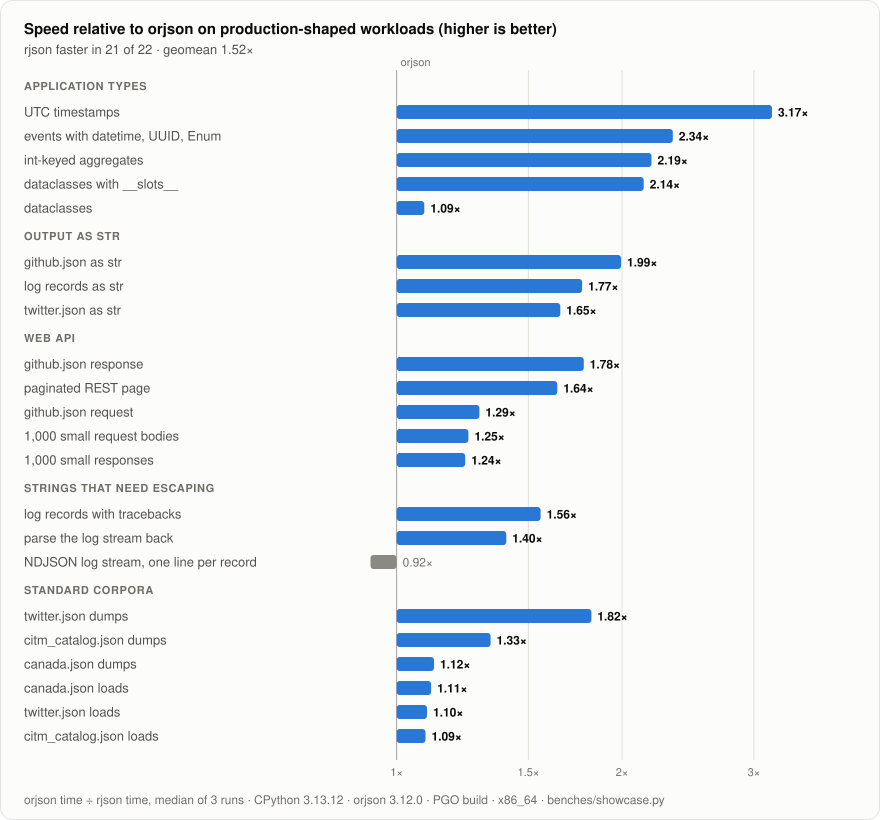
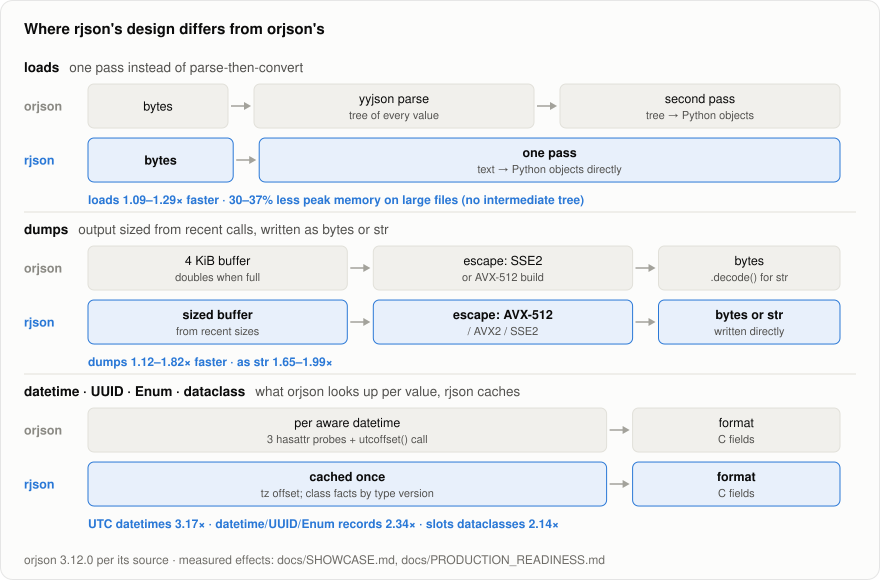

# rjson vs orjson: where the difference shows

A head-to-head comparison on the jobs a Python service actually does with JSON: API
responses and request bodies, log records, application types (datetimes, UUIDs, Enums,
dataclasses), `str` output, plus the standard corpora for reference. Every case first checks
that both libraries produce the same result (byte-identical output for `dumps`, equal objects
for `loads`), then times them interleaved in one process.

**Result (rjson 0.4.1): rjson is faster in 21 of 22 cases, 1.59× on the geometric
mean.** The one case where it is not ahead (per-record NDJSON, 0.97×, slightly
behind) is listed with the rest.

<picture>
  <source media="(prefers-color-scheme: dark)" srcset="img/showcase-dark.svg">
  
</picture>

Speedup = orjson's time ÷ rjson's time (higher is better). Median of 3 runs of
`benches/showcase.py --rounds 15`, each the median of 15 interleaved rounds; in parentheses
the lowest and highest of the 3 runs. CPython 3.13.12, orjson 3.12.0, x86_64 Xeon (4
cores), rjson PGO build (`scripts/build_pgo.sh`, as the published wheels are built). Raw
numbers: [showcase-results.json](showcase-results.json).

| workload | rjson | orjson | speedup |
|---|---|---|---|
| **Application types** (no `default=` needed in either) | | | |
| 5,000 UTC `datetime`s | 170 µs | 525 µs | **3.09×** (3.03–3.13) |
| 2,000 events with `datetime`, `UUID`, `Enum` | 411 µs | 944 µs | **2.31×** (2.18–2.31) |
| 2,000 `@dataclass(slots=True)` instances | 492 µs | 1.12 ms | **2.28×** (2.21–2.29) |
| dict with 5,000 int keys (`non_str_keys` / `OPT_NON_STR_KEYS`) | 88.5 µs | 184 µs | **2.08×** (2.06–2.12) |
| 1,000 dataclasses with nested items | 198 µs | 236 µs | **1.19×** (1.15–1.19) |
| **Output as `str`** (`dumps_str` vs `orjson.dumps(...).decode()`) | | | |
| github.json | 13.4 µs | 26.6 µs | **1.92×** (1.86–2.03) |
| log records | 412 µs | 762 µs | **1.85×** (1.81–1.93) |
| twitter.json | 291 µs | 472 µs | **1.62×** (1.60–1.69) |
| **Web API** | | | |
| paginated REST page (50 users, 45 KB) | 18.8 µs | 31.9 µs | **1.70×** (1.66–1.72) |
| github.json response (`dumps`, 55 KB) | 12.4 µs | 20.6 µs | **1.68×** (1.66–1.69) |
| 1,000 small request bodies, one `loads` each | 1.25 ms | 1.76 ms | **1.49×** (1.20–1.51) |
| github.json request (`loads` of bytes) | 68.2 µs | 101 µs | **1.49×** (1.48–1.50) |
| 1,000 small responses, one `dumps` each | 174 µs | 206 µs | **1.19×** (1.15–1.22) |
| **Strings that need escaping** (tracebacks, SQL, paths) | | | |
| 2,000 log records as one document | 405 µs | 667 µs | **1.64×** (1.48–1.65) |
| parse them back | 1.16 ms | 2.09 ms | **1.78×** (1.65–1.80) |
| NDJSON: one `dumps` per record, written to a stream | 1.01 ms | 972 µs | 0.97× (0.96–0.97) |
| **Standard corpora** | | | |
| twitter.json `dumps` / `loads` | 141 µs / 1.06 ms | 242 µs / 1.46 ms | **1.71×** / **1.35×** |
| citm_catalog.json `dumps` / `loads` | 422 µs / 3.88 ms | 595 µs / 4.24 ms | **1.41×** / **1.13×** |
| canada.json `dumps` / `loads` | 2.76 ms / 8.39 ms | 3.69 ms / 9.38 ms | **1.35×** / **1.10×** |

Times are the medians of the 3 runs.

## Why rjson is ahead

<picture>
  <source media="(prefers-color-scheme: dark)" srcset="img/architecture-dark.svg">
  
</picture>


Checked against orjson 3.12.0's source:

- **`loads`: one pass.** orjson parses into a yyjson document (a tree of every value),
  then walks it to create Python objects. rjson creates them while parsing, so it
  touches the input once and holds no tree (30–37% lower peak memory on large files).
- **Aware datetimes.** For each `datetime` on `datetime.timezone`, orjson probes three
  attributes (`convert`, `normalize`, `dst`) and calls `utcoffset()`. rjson reuses the
  offset of the last `timezone` object and reads the fields from the C struct.
- **Classes.** rjson caches per type whether it is a dataclass, has `__slots__`, and
  whether its Enum `_value_` or instance `__dict__` can be read without running Python
  code, keyed by `tp_version_tag` (reset whenever the class or a base changes).
- **Escaping.** orjson has SSE2 and an AVX-512 build option; rjson picks AVX-512, AVX2 or
  SSE2 at run time, so AVX2-only CPUs get 32-byte kernels.
- **Output buffer and `str`.** orjson starts every call from a 4 KiB buffer that doubles;
  rjson sizes it from recent calls. `dumps_str` writes the `str` directly, where orjson
  users decode its `bytes`. For non-ASCII text orjson calls `PyUnicode_AsUTF8AndSize`,
  which attaches a UTF-8 copy to every string it serializes; rjson does not for long
  strings.

Both use raw `METH_FASTCALL` entry points, cache dict keys and format floats with zmij.

## Found and fixed while building this comparison

The first run had rjson behind orjson on dataclasses (0.61×) and only at parity on
datetime/UUID/Enum events (1.05×). Profiling found per-value costs that orjson does not pay:

- For every datetime, UUID, Enum or dataclass value, rjson re-checked `sys.modules` for
  modules that are not imported. `zoneinfo` usually isn't, and each check built a
  temporary `str`, about 80 ns per value. Now the check runs again only when
  `len(sys.modules)` changes, with a forced re-check before a value is reported
  unsupported.
- Every Enum member walked its class's MRO, and every dataclass did two class-dict
  lookups. Both are now cached per type.
- Any dataclass sent the whole document to guarded mode, the slower path used when Python
  code may run mid-serialization. On CPython 3.12+ the standard `__dict__` of a class
  runs no Python code, so those dataclasses no longer do. On 3.10 and 3.11, creating the
  dict can run the garbage collector on the spot, so they stay guarded there.

The same comparison on the plain build, before → after: events 1.05× → 2.24×, UTC
timestamps 1.36× → 3.64×, dataclasses 0.61× → 1.1×.

## Where rjson is not ahead

**One `dumps` call per ~600-byte record with many escapes, results streamed out: 0.97×**
(0.92× in 0.3.0, 1.00× in 0.4.0; the 0.4.1 build runs the same `dumps` code with the same
instruction count, so the difference is code placement). The same records as one document
are 1.64× faster, so the escaping is not the cause. The
per-call fixed cost is, and on this record size it outweighs rjson's per-byte advantage.
Two output-buffer sizing variants (hinting from the largest reservation a call made, and
using the larger of the last two sizes for small outputs) cut buffer regrowth by 60% but
made no measurable difference, so they were not kept. Smaller records are faster in rjson
(1,000 small responses: 1.19×).

## Allocator effect: short-lived processes

Encode the same 2,000 log records one call at a time, keep the results (a batch for a queue
or a bulk insert), and do it in a new process that has not yet produced a large output:

| | time | page faults |
|---|---|---|
| rjson | 0.83–0.86 ms | 1–2 |
| orjson | 3.46–3.87 ms | 1,976 |

That is about 4.3× in rjson's favour. In this state glibc's malloc returns memory to the OS
and takes it back around every orjson call, one page fault per call. Once any output over
~128 KiB has been freed, glibc's thresholds rise and the effect disappears. The main table
above is measured in that warm state (the suite builds its big fixtures first), so it does
not include this effect. It is real for CLI tools, batch jobs, workers that restart often,
and serverless cold starts. `benches/showcase.py --fresh` measures it.

## Reproduce

```bash
benches/fetch_corpus.sh                         # sha256-pinned corpora -> benches/data/
scripts/build_pgo.sh python3.13 && pip install target/wheels/*cp313*.whl orjson
python benches/showcase.py --rounds 15 --fresh --output-json showcase.json
```

The reference benchmark (per-case `loads`/`dumps` on the corpora and synthetic cases, also
against `json`) is `benches/corpus_benchmark.py`. Production-shaped workloads with memory
(peak RSS) are in `benches/production_benchmark.py`, and the example integrations
(FastAPI, logging, codecs) are in `benches/examples_benchmark.py`. Methodology and history
are in [PERFORMANCE_REVIEW.md](PERFORMANCE_REVIEW.md).
